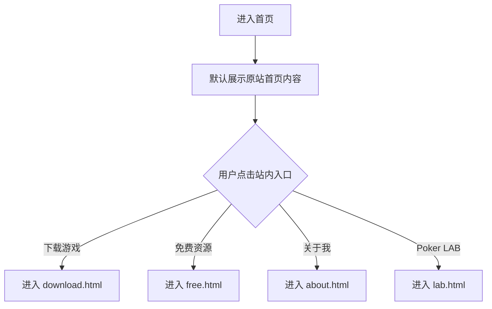

# 控客

# Travis Poker - 首页落地页

产品需求文档（PRD）

版本 V1.0 | 日期 2026-07-06

---

# 1. 页面说明

Travis Poker 页面组用于承接访问用户，展示品牌导航、欢迎标题、扑克娱乐入口、免费资源、关于我、Poker LAB 社群页和联系方式。

【重点】本次交付为多页面静态 HTML 镜像，视觉结构参考 `https://www.travispoker.com/`，包含 `index.html`、`download.html`、`free.html`、`about.html`、`lab.html`，并将站内跳转改为本地 HTML 文件。

# 2. 页面入口

菜单路径：独立访问页面

权限点：无登录权限限制，所有访问用户可见

关联模块：首页、下载游戏、免费资源、关于我、Poker LAB、联系方式

跨模块跳转：顶部导航和首页卡片按钮跳转至本地页面；下载、Telegram、Circle、邮箱、YouTube 等站外入口保留原站真实链接。

# 3. 页面布局

页面使用多页面静态站点布局。首页由顶部导航区、Hero 欢迎区、选择卡片区和页脚区组成；其他页面保持原站页面结构。

## 3.0 页面文件

| 页面 | 本地文件 | 对应原站路径 |
| --- | --- | --- |
| 首页 | `index.html` / `travis-poker.html` | `/` |
| 下载游戏 | `download.html` | `/download` |
| 免费资源 | `free.html` | `/free` |
| 关于我 | `about.html` | `/about` |
| Poker LAB | `lab.html` | `/lab` |

## 3.1 顶部导航区

- 左侧展示 Travis Poker 品牌 Logo。
- 中部展示导航：主页、下载游戏、免费资源、关于我。
- 移动端收起导航项，保留 Logo 与菜单按钮，点击菜单按钮展开导航面板。

## 3.2 Hero 欢迎区

- 顶部展示英文小标题 `LEVEL UP YOUR POKER GAME`。
- 小标题下方展示红色短分隔线。
- 主标题展示「欢迎你的加入」。

## 3.3 选择卡片区

页面首屏展示「轻松娱乐」卡片，并保留原站隐藏的「认真提升」卡片内容。

- 卡片包含胶囊标签、圆形图标、标题、副标题、描述、三项特性、主按钮和适用人群说明。
- 「轻松娱乐」卡片默认显示。
- 「轻松娱乐」卡片按钮跳转 `download.html`。
- 「认真提升」卡片按钮跳转 `lab.html`。

## 3.4 页脚区

- 左侧展示品牌小图标与说明「用系统化思维打好每一手牌」。
- 右侧展示邮箱和 YouTube 频道入口。
- 底部居中展示版权信息。

# 4. 筛选项

本页面无筛选项。

| 筛选项 | 控件类型 | 默认值 | 规则 |
| --- | --- | --- | --- |
| 无 | 无 | 无 | 无 |

# 5. 列表字段

本页面不包含后台列表。以下为页面内容模块字段说明：

| 字段 | 说明 | 是否默认展示 | 格式 / 交互 |
| --- | --- | --- | --- |
| 品牌 Logo | 展示 Travis Poker 标识 | 是 | 点击跳转 `index.html` |
| 导航项 | 展示主要页面入口 | 是 | 点击跳转对应本地 HTML 页面 |
| Hero 主标题 | 展示欢迎信息 | 是 | 静态文本 |
| 选择卡片 | 展示用户路径选择 | 是 | 保持原站显示规则 |
| 主按钮 | 进入游戏或策略分析入口 | 是 | 点击跳转 `download.html` 或 `lab.html` |
| 联系方式 | 展示邮箱和 YouTube 入口 | 是 | 邮箱使用 `mailto:`，YouTube 使用外部链接 |

# 6. 操作逻辑

| 操作 | 入口 | 权限 | 结果 | 风险等级 |
| --- | --- | --- | --- | --- |
| 返回主页 | Logo / 主页导航 | 无 | 跳转 `index.html` | 低 |
| 进入下载页 | 下载游戏导航 / 「马上进入游戏」 | 无 | 跳转 `download.html` | 低 |
| 进入免费资源页 | 免费资源导航 | 无 | 跳转 `free.html` | 低 |
| 进入关于页 | 关于我导航 | 无 | 跳转 `about.html` | 低 |
| 进入 Poker LAB | 首页策略卡按钮 / Poker LAB 链接 | 无 | 跳转 `lab.html` | 低 |
| 展开移动导航 | 移动端菜单按钮 | 无 | 保持原站 Webflow 导航交互 | 低 |
| 邮箱联系 | 页脚邮箱链接 | 无 | 调起系统邮件客户端 | 低 |
| 打开 YouTube | 页脚频道链接 | 无 | 新窗口打开频道链接 | 低 |

# 7. 新增 / 编辑 / 审核弹窗

本页面不包含新增、编辑、审核弹窗。

| 字段 | 必填 | 控件 | 校验规则 | 联动规则 | 说明 |
| --- | --- | --- | --- | --- | --- |
| 无 | 否 | 无 | 无 | 无 | 无弹窗字段 |

# 8. 状态流转

页面核心状态为「当前页面」和「移动导航」。

**流程说明**

- 站内链接均指向本地 HTML 文件。
- 站外链接保留原站真实地址。
- 移动端导航使用原站 Webflow 行为。

# 9. 异常处理

| 异常场景 | 处理方式 |
| --- | --- |
| 外部字体加载失败 | 使用系统字体兜底，页面仍可阅读 |
| Logo 图片加载失败 | 显示 CSS 品牌标识兜底 |
| 外部链接不可访问 | 浏览器按原链接打开，不阻断站内页面 |
| 小屏宽度不足 | 导航收起为移动菜单，卡片内容改为单列显示 |

# 10. 关联关系

| 关联模块 | 引用场景 | 数据来源 | 影响规则 |
| --- | --- | --- | --- |
| 下载游戏 | 娱乐卡片 CTA | 原站链接配置 | 点击跳转 `download.html` |
| Poker LAB | 策略卡片 CTA | 原站链接配置 | 点击跳转 `lab.html` |
| 联系方式 | 页脚邮箱 | 静态页面配置 | 点击调起邮件客户端 |
| 视频频道 | 页脚 YouTube | 静态页面配置 | 点击打开外部频道 |

# 11. 权限与日志

本页面无登录态、菜单权限、按钮权限和字段权限。

【说明】本地 HTML 保留原站页面结构和脚本，仅将站内链接重写到本地页面。

# 12. 重点、风险与待确认项

- 【重点】页面组需可直接通过浏览器打开，不依赖构建工具。
- 【重点】桌面端保持参考站的大留白、细线卡片、蓝色主按钮和页脚布局。
- 【重点】移动端应避免文字溢出，导航收起，卡片宽度自适应。
- 【风险】参考站点品牌、文案和图片可能存在版权或商标归属；正式商用前需确认授权。
- 【确认】真实下载地址、社群地址、邮箱和 YouTube 链接当前沿用参考站配置，需业务方最终确认。

# 13. 验收标准

- 页面可通过 `index.html` 或 `travis-poker.html` 直接打开。
- `download.html`、`free.html`、`about.html`、`lab.html` 均可直接打开。
- 桌面端顶部导航、Hero、卡片和页脚完整显示。
- 移动端导航可展开 / 收起，卡片内容不溢出。
- 默认显示「轻松娱乐」卡片。
- 点击「马上进入游戏」后进入 `download.html`。
- 点击「研究更多实战分析」后进入 `lab.html`。
- 页脚邮箱链接为 `mailto:`，YouTube 链接新窗口打开。
- 自动化检查脚本 `verify_travis_poker.js` 运行通过，确认站内链接已改为本地页面。

# 14. PRD 自检清单

- [x] 每个字段都有说明或明确标记不适用。
- [x] 条件必填的触发条件已说明。
- [x] 联动规则已说明，无联动填写「无」。
- [x] 每个按钮点击后的结果已说明。
- [x] 不涉及二次确认弹窗。
- [x] 不涉及批量操作。
- [x] 数据不存在、外部资源失败、小屏适配等异常已处理。
- [x] 跨模块引用的数据来源已标注。
- [x] 不涉及删除及关联影响。
- [x] 核心流程已补充 Mermaid 流程图。
- [x] 核心结论、风险、待确认项已按规范标记。
