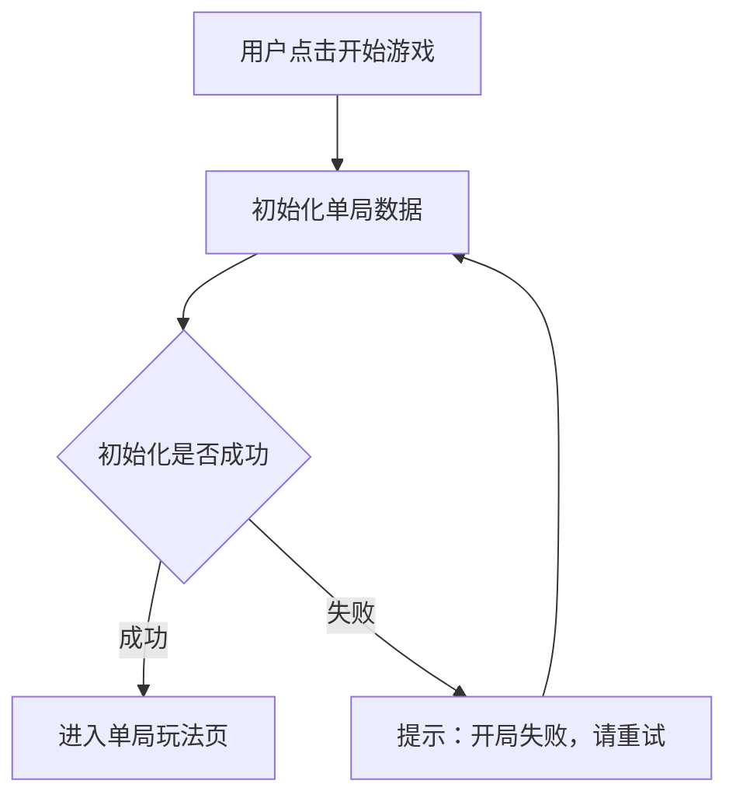
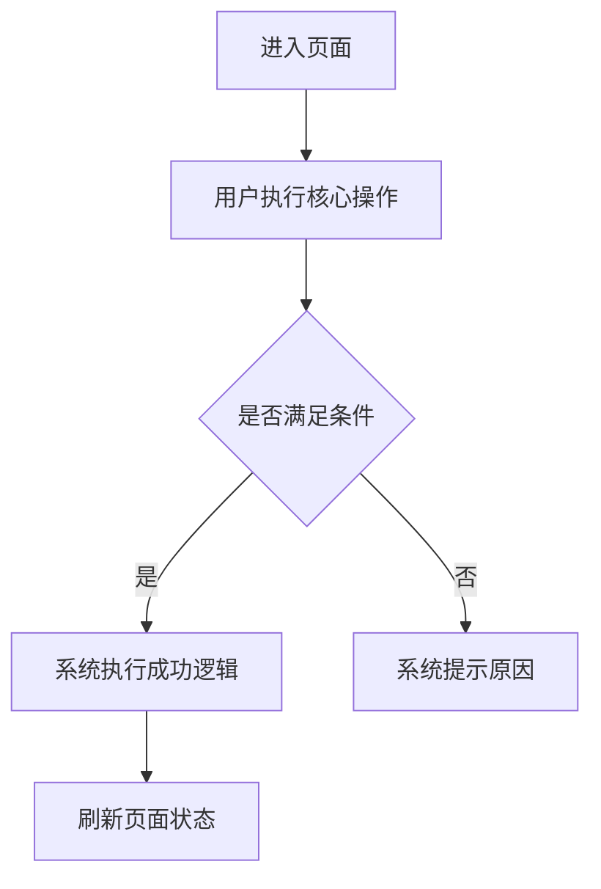
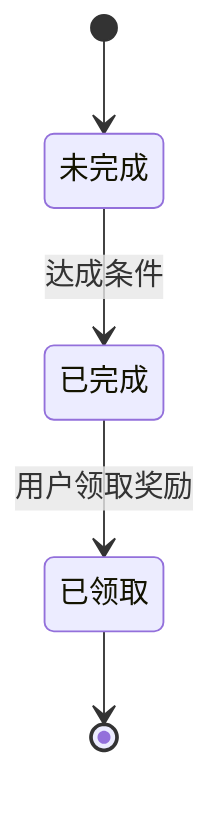
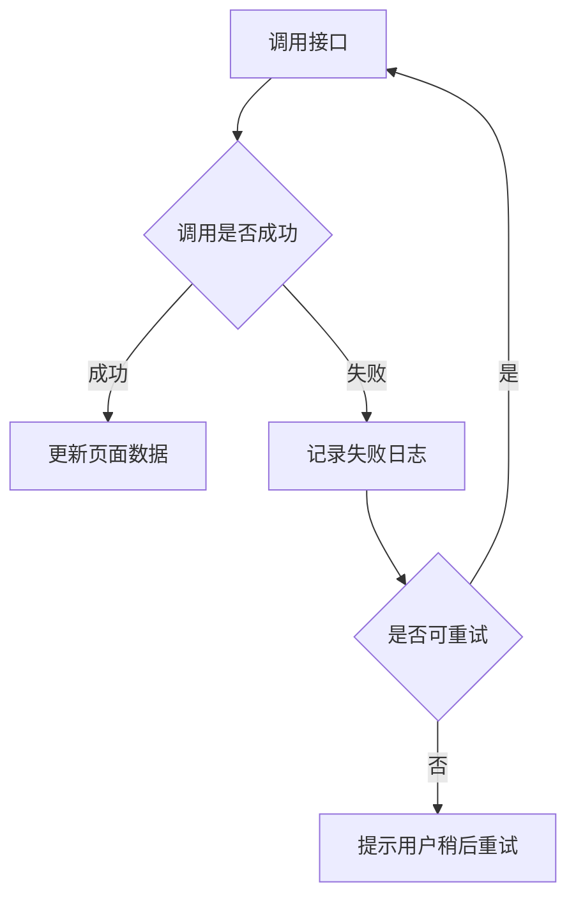

# PRD 生成规范文档

> 本文档定义控客 TG 营销平台产品需求文档的标准结构、格式规范与内容要求，适用于所有功能模块的 PRD 编写。

---

## 一、文档基本规范

### 1.1 文件头部格式

每个 MD 文件以以下格式开头：

```
# 控客

# [模块名称]

产品需求文档（PRD）

版本 V1.0　|　2026-03-26

---
```

### 1.2 章节编号规范

- 顶级章节：`# 一、二、三…` 或 `# 1. 2. 3.`
- 二级章节：`## X.X`
- 三级章节：`### X.X.X`
- 章节标题简洁，体现功能点，如：`## 2.3 新建策略`

### 1.3 文件命名规范

- 格式：`序号_模块名称.md`，如：`07_03_拉群任务.md`
- 大模块可拆分为多个子文件，编号连续，如：`07_01`、`07_02`…

---

## 二、PRD 必要内容结构

每个功能模块 PRD 必须包含以下章节（根据实际情况取舍）：

```
一、模块说明
二、[核心列表页]
  X.1 整体逻辑
  X.2 筛选项
  X.3 列表字段
  X.4 操作逻辑说明
  X.5 批量操作
三、新增 / 编辑弹窗
四、详情页
五、业务规则
六、异常处理
```

---

## 三、字段规范

### 3.1 筛选项表格

```markdown
| **筛选项** | **控件类型** | **选项 / 说明** |
| --- | --- | --- |
| 关键词搜索 | 文本输入框 | 按名称模糊搜索 |
| 状态 | 下拉单选 | 全部 / 启用 / 停用 |
| 时间范围 | 日期范围选择 | 创建时间区间 |
```

### 3.2 列表字段表格

```markdown
| **字段名** | **说明** | **是否默认显示** |
| --- | --- | --- |
| 名称 | 显示名称 | 是 |
| 状态 | 启用 / 停用，以色块标识 | 是 |
| 创建时间 | 精确到分钟 | 是 |
| 操作 | 编辑 / 删除 | 是 |
```

### 3.3 弹窗字段表格（标准五列）

```markdown
| **字段名** | **必填** | **校验规则** | **联动规则** | **说明** |
| --- | --- | --- | --- | --- |
| 名称 | 是 | 最多 50 字；不可重复；为空时【确认】置灰 | 无 | 显示名称 |
| 状态 | 是 | 默认启用 | 无 | 启用 / 停用 |
```

**必填列规范：**
- `是`：必填，为空时【确认】置灰
- `否`：选填
- `条件必填`：满足某条件时必填，校验规则中说明触发条件

**联动规则规范：**
- 无联动填写：`无`
- 有联动说明具体逻辑，如：`选择后关键词下拉列表实时过滤`

### 3.4 弹窗字段表格（简化三列）

适用于详情展示、日志等只读类表格：

```markdown
| **字段名** | **说明** | **是否默认显示** |
| --- | --- | --- |
```

---

## 四、操作逻辑说明规范

所有操作按钮必须说明点击后的结果：

```markdown
**操作逻辑说明**

- 【编辑】：弹出编辑弹窗，支持修改 XX、XX 字段
- 【删除】：弹出二次确认弹窗，提示「删除后不可恢复，是否确认？」；确认后删除
- 【启停】：直接切换状态，无需二次确认；停用后相关功能不再生效
```

**二次确认弹窗文案规范：**
- 普通删除：「删除后不可恢复，是否确认？」
- 有关联数据：「删除后该 [对象] 的 [关联内容] 将同步清除，不可恢复，是否确认？」
- 有占用场景：「当前 [对象] 正在被使用，是否确认 [操作]？」

---

## 五、批量操作规范

```markdown
## X.X 批量操作

勾选至少 1 个 [对象] 后，批量操作按钮可用：

| **操作** | **功能说明** | **注意事项** |
| --- | --- | --- |
| 批量启用 | 批量将选中对象状态改为启用 | — |
| 批量停用 | 批量将选中对象状态改为停用 | 停用后相关功能不再生效 |
| 批量删除 | 批量删除选中对象 | 弹出二次确认弹窗；删除后不可恢复 |
```

---

## 六、状态规范

### 6.1 状态定义表格

```markdown
| **状态** | **色块** | **触发条件** | **系统行为** |
| --- | --- | --- | --- |
| 启用 | 绿色 | 新建默认 / 手动启用 | 正常可用 |
| 停用 | 灰色 | 手动停用 | 前端不展示 / 不可调用 |
| 异常 | 红色 | 系统检测失败 | 告警 / 不可使用 |
```

### 6.2 常用状态色块规范

| 状态 | 颜色 |
|---|---|
| 成功 / 启用 / 正常 / 在线 | 绿色 |
| 失败 / 异常 / 封禁 | 红色 |
| 停用 / 离线 / 未测试 / 待执行 | 灰色 |
| 待审核 / 处理中 / 执行中 | 蓝色 |
| 警告 / 即将到期 | 橙色 |
| 已完成 | 绿色 |
| 已暂停 | 黄色 |

---

## 七、校验规则规范

### 7.1 表单校验提示规范

- 用户点击【确认】/【提交】时，对所有必填字段和格式规则统一校验
- 所有不合规字段同时展示提示，不逐个弹出
- 用户修正后对应提示实时消失，全部通过后按钮自动变为可用

### 7.2 常用校验规则写法

```
最多 50 字；不可重复；为空时【确认】置灰
URL 格式校验；格式错误时实时提示
正整数；最小值 1；为空时【确认】置灰
下拉单选；仅展示状态为【启用】的选项；未选择时【确认】置灰
下拉多选；至少选择 1 个；未选择时【确认】置灰
日期时间选择器；所选时间需晚于当前时间
```

### 7.3 字段置灰条件写法

- 必填为空：`为空时【确认】置灰`
- 条件必填未满足：`未选择时【确认】置灰`
- 整体不可用：`输入区置灰不可操作`

---

## 八、联动规则规范

联动字段必须说明：何时显示、显示后如何变化、变更后如何刷新。

```markdown
| 语言 | 是 | 下拉单选 | 选择后关键词下拉列表根据所选语言实时过滤 | 须先选语言再选关键词 |
| 关键词 | 条件必填 | 下拉单选；仅在语言选择后显示；未选择时【确认】置灰 | 语言变更后选项实时刷新 | — |
```

**常用联动写法：**
- `仅 [条件] 时显示`
- `[字段A] 变更后 [字段B] 实时刷新`
- `选择后展示 [信息]`
- `[字段A] 选择后 [字段B] 变为必填`

---

## 九、业务规则规范

业务规则用列表形式描述，每条规则单独成行，逻辑清晰：

```markdown
## X.X 业务规则

- [规则描述，主语明确，语义完整]

- 删除后 [对象] 的 [关联数据] 不受影响 / 同步清除

- [状态] 时 [操作] 不可执行，系统提示「[提示文案]」

- [字段] 为唯一标识，同一 [范围] 内不允许重复
```

---

## 十、异常处理规范

```markdown
## X.X 异常处理

| **异常场景** | **处理方式** |
| --- | --- |
| [具体异常情况] | 记录日志「[日志内容]」；[系统行为]；[是否影响其他] |
| [API 调用失败] | [重试次数]次后仍失败则记录日志跳过 |
| [数据不存在] | 提示「[提示文案]」；[后续处理] |
```

**常用处理方式写法：**
- `记录日志「[内容]」，跳过，不影响其他 [对象] 继续执行`
- `弹出二次确认弹窗，提示「[文案]」；确认后执行`
- `系统自动 [处理方式]；失败时 [兜底处理]`
- `提示 [文案]；不允许提交 / 【确认】置灰`

---

## 十一、页面布局规范

### 11.1 页签结构描述

```markdown
页面顶部以 Tab 形式切换 N 个子模块：**Tab1 / Tab2 / Tab3**
```

```markdown
页面左侧导航包含以下子页签：**列表 / 分组 / 日志**
```

### 11.2 弹窗类型说明

- **弹窗**：适用于新增、编辑、简单配置
- **侧边栏**：适用于详情查看、日志明细
- **独立页面**：适用于复杂配置、多步骤流程
- **浮层**：适用于快速设置（如翻译设置面板）

### 11.3 多步骤流程规范

```markdown
## X.X 第一步：[步骤名称]

## X.X 第二步：[步骤名称]

页面底部固定展示【退出】【上一步 / 下一步】【提交】按钮；
未通过校验时按钮置灰。
```

---

## 十二、数据展示规范

### 12.1 时间格式

- 精确到分钟：`2026-03-26 14:30`
- 精确到秒：`2026-03-26 14:30:00`
- 日期：`2026-03-26`

### 12.2 数量展示

- 超过 99 显示：`99+`
- 超过 999 显示：`999+`
- 数据不足时：`显示【—】`

### 12.3 列表默认排序

```
- 默认按创建时间倒序排列
- 有置顶逻辑时：置顶 > 有未读 > 无未读，各组内按时间倒序
```

### 12.4 空状态

- 列表无数据时展示空状态图和提示文案
- 筛选无结果时提示「暂无匹配数据，请调整筛选条件」

---

## 十三、权限与入口规范

```markdown
- [操作] 仅 [角色] 可操作；无权限时按钮置灰并提示「暂无权限」
- 入口：[模块名] → [页面名] → [操作按钮]
- 跨模块跳转：点击后跳转至 [目标模块] 中该 [对象] 的 [页面]
```

---

## 十四、关联关系规范

涉及跨模块引用时必须说明关联场景：

```markdown
## X.X 关联引用场景

| **关联模块** | **引用场景** |
| --- | --- |
| [模块名] | [具体引用场景描述] |
```

---

## 十五、需求输出规范

### 15.1 输出前必问清楚的问题

在不完全了解需求时，必须反问以下关键问题：

**数据来源类：**
- 数据从哪里来？手动配置 / 系统同步 / 第三方接口？
- 由谁配置？什么时候生效？

**逻辑类：**
- 操作成功后的下一步是什么？
- 操作失败后怎么处理？
- 有没有唯一性限制？
- 是否支持批量操作？

**状态类：**
- 有哪几种状态？各状态之间如何流转？
- 哪些状态下哪些操作不可执行？

**关联类：**
- 删除后关联数据如何处理？
- 被引用时是否可以删除？

### 15.2 需求确认工作流

1. 输出草稿内容
2. 等待用户确认（`确认后同步` 工作流）
3. 用户说「同步」后执行修改
4. 修改同步到对应 MD 文件

### 15.3 需求输出格式要求

- 生成的内容必须能直接交付给研发和测试
- 每个字段的校验规则、联动逻辑必须明确
- 异常情况必须覆盖，不能只写正常流程
- 操作按钮必须说明点击后的完整结果
- 跨模块的数据引用必须注明来源模块

---

## 十六、常用模块模板

### 16.1 基础列表模块模板

```markdown
# 一、模块说明

[模块功能描述，说明用途、适用场景和核心能力]

---

# 二、[列表名称]

## 2.1 整体逻辑

- 默认按创建时间倒序排列
- 支持列显示/隐藏自定义，配置保存在用户偏好中

## 2.2 筛选项

| **筛选项** | **控件类型** | **选项 / 说明** |
| --- | --- | --- |
| 关键词搜索 | 文本输入框 | 按名称模糊搜索 |
| 状态 | 下拉单选 | 全部 / 启用 / 停用 |

## 2.3 列表字段

| **字段名** | **说明** | **是否默认显示** |
| --- | --- | --- |
| 名称 | 显示名称 | 是 |
| 状态 | 启用 / 停用，以色块标识 | 是 |
| 创建时间 | 精确到分钟 | 是 |
| 操作 | 编辑 / 删除 | 是 |

**操作逻辑说明**

- 【编辑】：弹出编辑弹窗
- 【删除】：弹出二次确认弹窗，提示「删除后不可恢复，是否确认？」；确认后删除

## 2.4 新增弹窗字段

| **字段名** | **必填** | **校验规则** | **联动规则** | **说明** |
| --- | --- | --- | --- | --- |
| 名称 | 是 | 最多 50 字；不可重复；为空时【确认】置灰 | 无 | 显示名称 |
| 状态 | 是 | 默认启用 | 无 | 启用 / 停用 |

## 2.5 批量操作

| **操作** | **功能说明** | **注意事项** |
| --- | --- | --- |
| 批量启用 | 批量将选中对象状态改为启用 | — |
| 批量停用 | 批量将选中对象状态改为停用 | — |
| 批量删除 | 批量删除选中对象 | 需二次确认 |

---

# 三、业务规则

- [规则 1]
- [规则 2]
```

### 16.2 日志模块模板

```markdown
## X.X [日志名称]

### X.X.1 整体逻辑

- 记录所有 [触发操作] 的历史记录
- 每次 [操作] 完成后自动生成一条记录
- 记录保留 90 天

### X.X.2 筛选项

| **筛选项** | **控件类型** | **选项 / 说明** |
| --- | --- | --- |
| 操作人 | 下拉单选 | 按操作人员筛选 |
| 结果 | 下拉单选 | 全部 / 成功 / 失败 |
| 时间范围 | 日期范围选择 | 操作时间区间 |

### X.X.3 列表字段

| **字段名** | **说明** | **是否默认显示** |
| --- | --- | --- |
| 操作对象 | 操作的目标名称 | 是 |
| 结果 | 成功 / 失败，以色块标识 | 是 |
| 失败原因 | 失败时展示具体原因；成功时显示【—】 | 是 |
| 操作人 | 执行操作的系统用户 | 是 |
| 操作时间 | 精确到秒 | 是 |
```

---

## 十七、写作风格规范

- **主语明确**：系统 / 用户 / 管理员，明确谁执行什么动作
- **动词准确**：展示 / 显示 / 提示 / 记录 / 跳转 / 调用 / 更新 / 生成
- **条件句结构**：`[条件] 时，[系统行为]`
- **提示文案**：用「」引号包裹，如：提示「删除后不可恢复，是否确认？」
- **字段引用**：用【】包裹，如：【确认】按钮 / 【编辑】操作
- **状态值**：用【】包裹，如：【启用】/【停用】
- **模块/页面**：直接写名称，首次出现时加粗
- **接口名**：用代码格式，如：`messages.sendMessage`

---

## 十八、重点内容颜色标记与流程图规范

### 18.1 重点内容颜色标记规范

Markdown 原生不支持稳定的文字颜色。为保证在不同平台中可读，重点标记采用“两层写法”：

- 第一层：使用文本标签，如 `【重点】`、`【风险】`、`【确认】`
- 第二层：在支持 HTML 渲染的平台中，可追加 `<span style="color: 色值">文字</span>` 或 `<mark>文字</mark>`

**重点类型与颜色规范**

| **类型** | **文本标签** | **建议颜色** | **使用场景** | **示例** |
| --- | --- | --- | --- | --- |
| 核心重点 | `【重点】` | 蓝色 `#1570EF` | 核心功能、核心目标、关键结论 | `【重点】首发版本只验证核心单局体验` |
| 风险 / 阻塞 | `【风险】` | 红色 `#D92D20` | 可能导致延期、返工、体验失败的问题 | `【风险】后期节奏过稳会削弱复玩动力` |

**推荐写法**

```markdown
【重点】首发版本聚焦一个核心模式：开放大地图吞噬生存。

【风险】如果前 1 分钟成长反馈不足，用户可能无法进入“再来一局”的循环。

【确认】真实广告 SDK 是否在 V1.0 接入，需要商业化负责人确认。
```

**当前项目 HTML 自动标色规则**

本项目的 `scripts/generate-doc-html.js` 已支持自动识别重点标签。Markdown 中保留纯文本标签即可，生成 `files/文档HTML/*.html` 时自动转为带颜色的 HTML 标记。

- 仅当 `【重点】`、`【风险】`、`【确认】`、`【已定】`、`【说明】` 出现在段落、列表项或表格单元格开头时自动标色。
- 正文中的普通按钮名不会自动标色，例如：`用户点击【确认】按钮` 会保持普通文本。
- 需要标色时，优先把标签放在一句话开头，例如：`【重点】国家管理是代理 IP 地区选择的统一数据来源。`

**HTML 增强写法**

仅在目标 Markdown 平台支持 HTML 样式时使用：

```markdown
<span style="color:#1570EF;">【重点】首发版本聚焦一个核心模式：开放大地图吞噬生存。</span>

<span style="color:#D92D20;">【风险】如果前 1 分钟成长反馈不足，用户可能无法进入“再来一局”的循环。</span>

<mark>【确认】真实广告 SDK 是否在 V1.0 接入，需要商业化负责人确认。</mark>
```

**使用规则**

- 同一段落最多使用 1 个重点标签，避免整页都变成重点。
- 只有影响范围、实现优先级、验收标准、风险判断的内容才标记。
- 不使用颜色表达唯一含义，必须同时保留文字标签，避免导出 PDF、复制到 IM、平台过滤 HTML 后丢失语义。
- 表格中如需标记重点，优先在字段说明前加文本标签，如 `【风险】接口失败后需保留重试日志`。

### 18.2 重点流程图描述规范

涉及用户路径、系统状态流转、审批链路、任务执行链路、异常兜底链路时，必须补充流程图描述。

**必须画流程图的场景**

- 用户从入口到完成目标存在 3 步及以上操作。
- 流程中存在判断条件，如是否登录、是否已领取、是否失败、是否可复活。
- 流程涉及多个模块之间的数据读写。
- 流程存在异常分支或兜底策略。
- 流程会影响研发拆任务或测试写用例。

**优先使用 Mermaid 流程图**

````markdown

````

**节点命名规范**

| **节点类型** | **写法** | **示例** |
| --- | --- | --- |
| 用户操作 | `用户 + 动作` | `用户点击开始游戏` |
| 系统行为 | `系统 + 动作` | `系统初始化单局数据` |
| 判断条件 | 使用问句 | `今日是否已领取？` |
| 页面跳转 | `进入 / 返回 + 页面名` | `进入结算页` |
| 异常处理 | `提示 / 记录 / 跳过 + 结果` | `提示金币不足，不允许购买` |

**常用流程图模板**

用户主流程：

````markdown

````

状态流转流程：

````markdown

````

异常兜底流程：

````markdown

````

**流程图配套说明**

流程图下方必须补充 2-4 条文字说明，解释关键判断与异常分支：

```markdown
**流程说明**

- 用户点击【开始游戏】后，系统立即初始化单局数据，不增加二次确认。
- 初始化失败时提示「开局失败，请重试」，用户可再次触发初始化。
- 初始化成功后进入单局玩法页，并开始记录生存时长。
```

**使用规则**

- 一个章节最多放 1 张主流程图；复杂模块可拆成“主流程图 + 异常流程图”。
- 流程图节点文字要短，详细规则写在流程说明或业务规则中。
- 判断节点必须写清楚“是 / 否”或具体分支含义。
- 不在流程图中塞字段表、长文案、接口字段，避免图变得不可读。

---

## 十九、PRD 质量自检清单

在输出 PRD 前，逐项确认：

**字段完整性**
- [ ] 每个字段都有校验规则
- [ ] 条件必填的触发条件已说明
- [ ] 联动规则已说明（无联动填写「无」）

**操作完整性**
- [ ] 每个按钮点击后的结果已说明
- [ ] 二次确认弹窗文案已写
- [ ] 批量操作的边界情况已说明

**异常完整性**
- [ ] 数据不存在的情况已处理
- [ ] 接口失败的情况已处理
- [ ] 状态限制的情况已说明

**关联完整性**
- [ ] 跨模块引用的数据来源已标注
- [ ] 删除时的关联影响已说明
- [ ] 被引用时能否删除已说明

**逻辑完整性**
- [ ] 正常流程完整
- [ ] 异常流程完整
- [ ] 边界情况已考虑

**重点与流程**
- [ ] 核心结论、风险、待确认项已按规范标记
- [ ] 3 步以上核心流程已补充 Mermaid 流程图
- [ ] 流程图下方已补充关键流程说明
