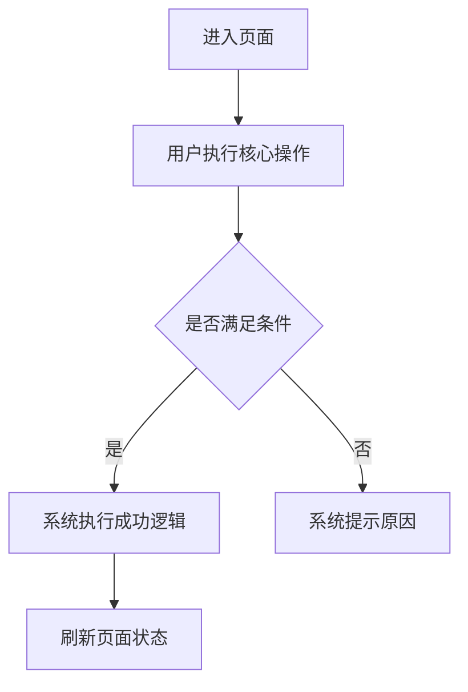

# 后台 Web 前端规范

版本：V1.0  
日期：2026-05-25  
适用范围：DeFi 挖矿运营后台、财务审核后台、权限配置后台及同类数据运营型 Web 管理系统。

---

# 1. 规范目标

本规范用于统一后台 Web 前端的页面结构、交互行为、视觉样式、组件使用、接口协作、权限控制、异常处理和验收标准，确保不同模块在设计、开发、测试和交付过程中保持一致。

后台系统的首要目标不是展示品牌，而是提升运营效率、降低误操作风险、保证数据可追溯。因此页面应以信息密度、操作清晰度、状态可识别性和高风险操作安全性为核心。

---

# 2. 基础原则

## 2.1 业务优先

- 页面结构围绕运营人员的真实工作流组织，优先支持查询、审核、配置、导出、复核、追踪。
- 核心信息应在列表中默认展示，低频信息进入详情页或展开区。
- 高频操作应减少跳转，优先使用弹窗、抽屉或行内操作完成。
- 高风险操作必须有确认、权限校验、操作日志和结果反馈。

## 2.2 一致性优先

- 同类页面使用统一布局：筛选区、操作区、表格区、分页区。
- 同类字段保持同名、同格式、同交互，例如用户 ID、钱包地址、订单号、状态、创建时间、操作人。
- 同类状态使用统一颜色、文案和排序。
- 同类弹窗使用统一宽度、按钮位置、校验方式和关闭逻辑。

## 2.3 清晰高效

- 后台页面避免营销式大图、装饰性卡片和过度动画。
- 页面应支持快速扫描，表格列宽、状态标签、金额、时间、地址等信息要易读。
- 操作按钮文案应直接描述结果，例如「审核通过」「锁定订单」「复制地址」。
- 不使用含糊文案，例如「处理」「操作」「确认一下」。

## 2.4 风险可控

- 涉及资金、地址、权限、系统配置、私钥、API 出款、收益规则的操作必须纳入高风险操作。
- 高风险操作需要二次确认，必要时要求输入备注、验证码、二次口令或审批原因。
- 所有关键操作必须生成操作日志。
- 前端不得隐藏后端校验，前端校验只用于提升体验，最终规则以后端为准。

---

# 3. 信息架构规范

## 3.1 推荐模块结构

后台一级菜单建议按业务域划分：

| 一级模块 | 二级模块示例 | 说明 |
| --- | --- | --- |
| 首页 / 仪表盘 | 数据概览、快捷入口、待办事项 | 展示关键指标和待处理事项 |
| 会员管理 | 会员列表、余额变动、登录日志、站内信、归集订单 | 用户身份、资产、行为和消息 |
| 财务管理 | 充值订单、充值设置、提现订单、提现配置 | 资金入账、出账、审核和规则 |
| 理财 / 挖矿管理 | 收益利率、挖矿收益记录、收益统计 | 挖矿收益配置和结果追踪 |
| 活动管理 | 空投活动、奖励活动、领取记录 | 运营活动和奖励发放 |
| 配置管理 | 轮播图、地址管理、文本配置 | 前台内容和链上地址配置 |
| 权限管理 | 后台用户、角色、部门、岗位、菜单权限 | 后台账号和权限体系 |
| 系统设置 | 站点配置、上传配置、客服设置、全局参数 | 站点级基础配置 |
| 日志审计 | 操作日志、登录日志、接口日志、异常日志 | 风控、排障和追责 |

## 3.2 菜单规范

- 菜单最多建议三级，超过三级应重新拆分业务模块。
- 菜单名称使用业务名词，不使用技术名词。
- 当前菜单高亮必须清晰，父级菜单保持展开。
- 无权限菜单不展示；有入口但无操作权限时，按钮禁用或隐藏由权限策略统一决定。
- 菜单顺序按照业务频率和风险等级排列：高频查询在前，高风险配置靠后。

## 3.3 面包屑与标签页

- 多页面后台建议支持顶部标签页，便于运营人员在多个列表间切换。
- 标签页标题应与菜单或详情对象一致，例如「提现订单」「会员详情 - 10086」。
- 面包屑用于体现当前位置，不承担主要导航。
- 关闭标签页时，不应丢失未保存表单，需提示「当前内容未保存，是否离开？」。

---

# 4. 页面布局规范

## 4.1 标准列表页结构

标准列表页由以下区域组成：

1. 页面标题区：展示页面名称、辅助说明、刷新按钮、帮助入口。
2. 筛选区：展示常用查询条件。
3. 操作区：展示新增、批量操作、导出、刷新等按钮。
4. 表格区：展示数据主体。
5. 分页区：展示分页、总条数、每页条数。

布局顺序固定为：

```text
页面标题
筛选区
操作区
数据表格
分页
```

## 4.2 筛选区规范

- 筛选项默认展示高频字段，低频字段放入「更多筛选」。
- 筛选区默认不超过 2 行，超过时折叠。
- 筛选项从左到右按查询频率排列。
- 时间范围字段放在筛选区靠前位置。
- 查询按钮使用主按钮，重置按钮使用次按钮。
- 回车触发查询，仅在文本输入框聚焦时生效。
- 重置应清空筛选条件并回到第一页。

常用筛选项：

| 筛选项 | 控件类型 | 规则 |
| --- | --- | --- |
| 关键词 | 输入框 | 支持用户 ID、订单号、地址、备注等模糊或精确搜索 |
| 状态 | 下拉单选 / 多选 | 默认全部 |
| 用户类型 | 下拉单选 | 正常用户 / 测试用户 / 代理用户 |
| 链 | 下拉单选 | ETH / BSC / TRON 等 |
| 币种 | 下拉单选 | USDT / ETH / BTC 等 |
| 创建时间 | 日期时间范围 | 默认最近 7 天或不限制，按业务确定 |
| 操作人 | 下拉搜索 | 支持后台账号搜索 |

## 4.3 操作区规范

- 主操作放左侧，例如「新增」「批量启用」「导出」。
- 辅助操作放右侧，例如「刷新」「列设置」。
- 批量操作必须在选中至少 1 条数据后可用。
- 高风险批量操作必须二次确认，并展示影响数量。
- 导出类操作需受权限控制，并限制最大导出范围。

## 4.4 表格区规范

- 表格是后台页面主体，应保证稳定、清晰、可横向扫描。
- 默认展示核心字段，非核心字段可通过列设置控制。
- 表头固定，数据较多时支持横向滚动。
- 首列可为复选框，末列固定为操作列。
- 操作列固定在右侧。
- 长文本、地址、Hash 默认省略，中间截断，并支持复制和悬浮查看完整内容。
- 金额、数量、比例右对齐；文本左对齐；状态居中或左对齐保持统一。
- 空值统一显示 `-`，不得显示 `null`、`undefined`、空白。

## 4.5 分页规范

- 默认每页 20 条，可选 20 / 50 / 100。
- 页码变化、每页条数变化都应触发查询。
- 筛选条件变化后回到第一页。
- 分页区展示总条数，例如「共 1286 条」。
- 大数据列表不允许一次性加载全部数据。

---

# 5. 表格字段规范

## 5.1 通用字段顺序

列表字段建议按以下顺序排列：

| 顺序 | 字段类型 | 示例 |
| --- | --- | --- |
| 1 | 主体标识 | ID、订单号、用户 ID、地址 |
| 2 | 业务核心字段 | 金额、币种、链、收益、费率 |
| 3 | 状态字段 | 订单状态、启用状态、审核状态 |
| 4 | 关联字段 | 上级用户、代理、操作人 |
| 5 | 时间字段 | 创建时间、更新时间、审核时间 |
| 6 | 备注字段 | 用户备注、后台备注、失败原因 |
| 7 | 操作字段 | 查看、编辑、审核、删除 |

## 5.2 金额字段

- 金额字段必须明确币种。
- 默认保留精度按币种配置，USDT 建议保留 2 到 6 位。
- 金额展示禁止使用科学计数法。
- 正向金额可用绿色，负向金额可用红色，但不应只依赖颜色，应保留正负号。
- 金额复制时复制原始完整值。

示例：

```text
1,250.50 USDT
-35.000000 USDT
```

## 5.3 地址与 Hash 字段

- 地址默认中间截断，例如 `0x1234...abcd`。
- 悬浮展示完整地址。
- 提供复制按钮，复制成功后提示「已复制」。
- 如配置区块浏览器地址，可提供外链跳转。
- 地址字段不得自动换行导致表格高度失控。

## 5.4 时间字段

- 统一格式：`YYYY-MM-DD HH:mm:ss`。
- 后台展示时区需与系统配置一致，默认按服务器时区或业务指定时区。
- 时间范围筛选包含开始时间和结束时间。
- 相对时间可作为辅助信息，但不可替代绝对时间。

## 5.5 状态字段

状态必须使用统一标签组件：

| 状态类型 | 颜色 | 示例 |
| --- | --- | --- |
| 成功 / 启用 / 正常 / 在线 | 绿色 | 成功、启用、正常 |
| 失败 / 异常 / 封禁 / 拒绝 | 红色 | 失败、异常、已封禁 |
| 待审核 / 处理中 / 执行中 | 蓝色 | 待审核、处理中 |
| 停用 / 离线 / 未执行 | 灰色 | 停用、离线 |
| 警告 / 即将到期 / 风险 | 橙色 | 风险、待复核 |
| 暂停 / 锁定 | 黄色 | 已锁定、已暂停 |

状态文案应使用业务语言，不直接展示后端枚举值。

---

# 6. 表单与弹窗规范

## 6.1 弹窗使用场景

适合弹窗：

- 新增、编辑少量字段。
- 审核通过、审核拒绝、锁定、启停。
- 查看简短详情。
- 输入备注、Hash、原因等补充信息。

不适合弹窗：

- 字段超过 20 个的复杂表单。
- 包含多步骤、多标签、复杂联动的配置。
- 需要频繁对照列表信息的大型详情。

复杂表单应使用独立页面或抽屉。

## 6.2 弹窗尺寸

| 类型 | 宽度建议 | 场景 |
| --- | --- | --- |
| 小弹窗 | 420px - 520px | 删除确认、启停确认 |
| 中弹窗 | 600px - 760px | 新增、编辑、审核 |
| 大弹窗 | 880px - 1080px | 复杂配置、富文本、详情 |

弹窗高度超过视口时，内容区滚动，底部按钮固定。

## 6.3 表单布局

- 表单标签左对齐或右对齐需全系统统一。
- 必填项使用红色星号标识。
- 输入框、选择器、日期控件高度统一。
- 同一表单内控件宽度统一，特殊字段可单独加宽。
- 帮助说明放在字段下方或提示图标中。
- 不允许用占位符替代表单标签。

## 6.4 表单校验

- 点击提交时统一校验所有必填项和格式。
- 校验失败时，错误信息显示在字段下方。
- 用户修正后，错误提示实时消失。
- 提交按钮在提交中进入 loading 状态，防止重复提交。
- 后端返回字段级错误时，应映射到对应字段。
- 后端返回全局错误时，在弹窗顶部或消息提示中展示。

常用校验：

| 字段类型 | 校验规则 |
| --- | --- |
| 名称 | 必填，最长 50 字，同范围内不可重复 |
| 金额 | 必填，数字，大于等于 0，精度符合币种配置 |
| 比例 / 费率 | 必填，0 到 100 之间，可配置小数位 |
| 地址 | 必填时校验链地址格式 |
| URL | 校验 URL 格式 |
| 时间范围 | 开始时间不得晚于结束时间 |
| 备注 | 最长 500 字，高风险操作必填 |

## 6.5 弹窗按钮

- 主按钮固定在右侧，文案为「确认」「提交」「保存」「审核通过」等明确动作。
- 次按钮为「取消」。
- 删除、拒绝、封禁等危险操作使用危险按钮样式。
- 弹窗关闭前，如表单已修改但未保存，需提示确认离开。

---

# 7. 详情页规范

## 7.1 详情页结构

详情页建议由以下区域组成：

1. 基础信息：主体对象的核心字段。
2. 状态信息：当前状态、风险标记、审核状态。
3. 资产 / 资金信息：余额、授权、收益、充值、提现。
4. 关联记录：订单、日志、收益、活动、站内信等。
5. 操作记录：后台操作日志。

## 7.2 信息展示

- 详情字段使用描述列表或分组表格。
- 重要状态放在页面顶部。
- 地址、订单号、Hash 支持复制。
- 涉及金额的字段必须展示币种。
- 敏感字段默认脱敏，具备权限后才可查看完整值。

## 7.3 详情操作

- 高风险操作固定在明显区域，但不应误触。
- 不同权限看到的操作不同。
- 操作后详情页和关联列表应自动刷新。

---

# 8. 交互反馈规范

## 8.1 加载状态

- 首次进入页面显示骨架屏或 loading。
- 表格查询时仅表格区域 loading，不阻塞整页。
- 按钮提交时按钮 loading，并禁止重复点击。
- 长耗时任务应展示进度、任务状态或异步结果入口。

## 8.2 成功反馈

- 普通成功使用轻量提示，例如「保存成功」「审核成功」。
- 成功后应刷新当前列表或更新当前行数据。
- 新增成功后可关闭弹窗并回到列表。
- 编辑成功后保留当前筛选条件和分页。

## 8.3 失败反馈

- 普通失败展示错误原因。
- 网络错误提示「网络异常，请稍后重试」。
- 权限错误提示「当前账号无此操作权限」。
- 数据不存在提示「数据不存在或已被删除」。
- 高风险操作失败需保留用户已输入内容，避免重复填写。

## 8.4 空状态

- 无数据时展示统一空状态，不显示空白区域。
- 筛选无结果时提示「暂无匹配数据」。
- 初始无数据时提示「暂无数据」。
- 空状态可提供刷新或重置筛选入口。

---

# 9. 操作规范

## 9.1 行内操作

- 行内操作最多展示 3 个高频按钮，其余放入「更多」。
- 操作顺序建议：查看、编辑、审核、启停、删除。
- 危险操作放最后。
- 当前状态下不可执行的操作应隐藏或禁用，并保持全系统一致。

## 9.2 批量操作

- 未选中数据时，批量按钮禁用。
- 批量操作前展示影响数量。
- 批量操作应返回成功数、失败数和失败原因。
- 批量导出、批量审核、批量启停必须记录日志。

## 9.3 高风险操作

高风险操作包括但不限于：

- 审核充值、提现。
- 修改提现配置、收益利率、归集地址、授权地址、出款地址。
- 启停自动归集、API 出款、收益发放。
- 新增或修改后台用户、角色权限。
- 删除关键配置。
- 查看或操作敏感字段。

高风险操作要求：

- 二次确认。
- 操作原因或备注必填。
- 前端展示关键影响信息。
- 后端再次校验权限和状态。
- 操作成功后写入日志。

确认文案示例：

```text
确认审核通过该提现订单？
通过后系统将进入出款流程，请确认金额、地址和链信息无误。
```

```text
确认修改归集地址？
修改后新归集任务将使用新地址，历史订单不受影响。
```

---

# 10. 权限规范

## 10.1 权限类型

| 权限类型 | 说明 |
| --- | --- |
| 菜单权限 | 控制是否可进入页面 |
| 按钮权限 | 控制新增、编辑、删除、审核、导出等操作 |
| 数据权限 | 控制可查看的数据范围，例如部门、代理、站点 |
| 字段权限 | 控制敏感字段是否展示完整值 |
| 审批权限 | 控制高风险操作是否可执行 |

## 10.2 前端权限处理

- 登录后获取用户信息、角色、权限点、菜单树。
- 路由根据菜单权限动态生成。
- 按钮根据权限点控制展示或禁用。
- 敏感字段根据字段权限脱敏。
- 前端权限只用于体验优化，后端必须做最终鉴权。

## 10.3 无权限场景

- 无页面权限：跳转 403 页面。
- 无按钮权限：隐藏按钮或禁用按钮。
- 会话过期：清理登录状态并跳转登录页。
- 多端登录冲突：按业务策略提示并退出。

---

# 11. 数据与接口规范

## 11.1 请求规范

- 所有接口统一携带认证信息。
- 列表接口统一支持分页、排序、筛选。
- 时间范围使用明确字段，例如 `startTime`、`endTime`。
- 金额字段建议以字符串传输，避免精度丢失。
- ID、订单号、Hash、地址等标识字段不得被前端自动转换为数字。

## 11.2 响应规范

接口响应建议统一结构：

```json
{
  "code": 0,
  "message": "success",
  "data": {},
  "traceId": "request-trace-id"
}
```

列表响应建议：

```json
{
  "list": [],
  "total": 0,
  "page": 1,
  "pageSize": 20
}
```

## 11.3 错误码处理

| 类型 | 前端处理 |
| --- | --- |
| 未登录 / Token 失效 | 跳转登录页 |
| 无权限 | 展示无权限提示或 403 页面 |
| 参数错误 | 展示字段级或全局错误 |
| 状态冲突 | 提示数据已变化并刷新 |
| 服务异常 | 展示错误提示并记录日志 |
| 风控拦截 | 展示业务原因，不自动重试 |

## 11.4 防重复提交

- 提交按钮 loading 期间不可重复点击。
- 高风险操作可增加请求幂等 ID。
- 列表刷新和搜索请求应处理并发覆盖，避免旧响应覆盖新数据。

---

# 12. 视觉规范

## 12.1 整体风格

- 后台系统采用克制、清晰、工具化的视觉风格。
- 主色用于主按钮、当前菜单、链接和关键聚焦状态。
- 页面背景使用浅灰或白色，内容区保持高对比。
- 避免大面积渐变、装饰图、低对比文字和复杂阴影。

## 12.2 间距

| 场景 | 建议 |
| --- | --- |
| 页面边距 | 16px - 24px |
| 区块间距 | 16px |
| 表单项间距 | 16px - 24px |
| 按钮间距 | 8px |
| 表格单元格横向内边距 | 12px - 16px |

## 12.3 字号

| 类型 | 字号 |
| --- | --- |
| 页面标题 | 18px - 20px |
| 区块标题 | 16px |
| 正文 / 表格 | 14px |
| 辅助说明 | 12px - 13px |

后台页面不使用超大标题。紧凑表格内不得使用过大的字体。

## 12.4 按钮

- 主按钮：页面主操作，例如查询、新增、保存、提交。
- 次按钮：取消、重置、返回。
- 危险按钮：删除、拒绝、封禁、清空、关闭关键功能。
- 图标按钮必须有 tooltip。
- 同一区域按钮高度一致。

## 12.5 标签

- 状态、类型、风险等级使用标签。
- 标签文案不超过 6 个汉字为宜。
- 同一状态在全系统颜色一致。
- 标签不能替代按钮。

---

# 13. 响应式规范

## 13.1 桌面优先

后台系统以桌面端为主，推荐支持以下宽度：

| 宽度 | 适配要求 |
| --- | --- |
| 1920px | 展示完整信息密度 |
| 1440px | 标准办公屏完整可用 |
| 1366px | 保证核心表格和操作可用 |
| 1024px | 允许折叠菜单、横向滚动 |

## 13.2 小屏处理

- 左侧菜单可折叠。
- 筛选区自动换行或折叠。
- 表格允许横向滚动。
- 操作列固定。
- 弹窗宽度不超过视口宽度。

## 13.3 移动端

如后台需要移动端访问，应单独设计移动操作流。资金审核、地址配置、权限配置等高风险操作不建议在移动端开放，除非有额外安全校验。

---

# 14. 安全规范

## 14.1 敏感信息

敏感信息包括：

- 私钥、助记词、API Key。
- 钱包地址、出款地址、授权地址。
- 用户手机号、邮箱、实名信息。
- 后台账号信息。
- 资金金额、余额、收益、提现记录。

处理要求：

- 私钥、助记词原则上不得在前端展示。
- API Key 默认脱敏，只在创建时展示一次。
- 钱包地址可展示，但复制和外链需受权限控制。
- 敏感字段查看完整值应记录日志。

## 14.2 XSS 与内容安全

- 富文本展示必须做白名单过滤。
- 用户输入内容输出到页面时必须转义。
- 外链跳转应使用安全策略，避免 opener 风险。
- 上传图片和文件需限制类型、大小和来源。

## 14.3 登录与会话

- Token 失效后自动跳转登录页。
- 长时间无操作可自动退出或提示续期。
- 多标签页登录状态需同步。
- 登出时清理本地认证信息和敏感缓存。

---

# 15. 性能规范

## 15.1 页面性能

- 首屏核心内容应尽快可见。
- 大型模块按路由懒加载。
- 表格数据分页加载。
- 大型下拉选项使用远程搜索或虚拟滚动。
- 图片懒加载，上传前压缩按业务决定。

## 15.2 表格性能

- 超过 1000 条不允许前端全量渲染。
- 大表格支持分页，必要时使用虚拟列表。
- 列设置、筛选条件、分页参数可按用户偏好缓存。
- 高频刷新页面应避免全局重渲染。

## 15.3 请求性能

- 搜索输入建议防抖。
- 相同查询可按业务进行短缓存。
- 并发请求应处理取消或响应顺序。
- 导出任务建议异步化，避免接口超时。

---

# 16. 可访问性与可用性

- 所有表单控件必须有明确标签。
- 颜色不能作为唯一信息表达方式。
- 按钮、链接、输入框必须有可识别的聚焦状态。
- 表格操作支持键盘聚焦。
- 错误提示应靠近出错字段。
- 重要操作不能只依赖图标，必要时加文字或 tooltip。

---

# 17. 日志与审计规范

## 17.1 前端埋点

建议记录以下行为：

- 页面访问。
- 查询、筛选、导出。
- 新增、编辑、删除。
- 审核通过、拒绝、锁定。
- 查看敏感字段。
- 接口异常。

## 17.2 操作日志字段

| 字段 | 说明 |
| --- | --- |
| 操作时间 | 精确到秒 |
| 操作人 | 后台账号 ID 和名称 |
| 操作模块 | 所属菜单或页面 |
| 操作对象 | 用户 ID、订单号、配置 ID 等 |
| 操作类型 | 新增、编辑、删除、审核、导出 |
| 操作前 | 变更前关键字段 |
| 操作后 | 变更后关键字段 |
| IP / 设备 | 操作来源 |
| 结果 | 成功 / 失败 |
| 失败原因 | 失败时记录 |

---

# 18. 模块页面规范

## 18.1 首页仪表盘

首页仪表盘是后台全局框架，应承载菜单导航、顶部工具栏、标签页管理、通知、全局搜索、全屏、当前登录用户状态和内容区渲染。

仪表盘已定规则：

- 左侧菜单根据登录用户角色权限动态渲染，无权限菜单不展示。
- 当前页面对应菜单项必须高亮，一级菜单支持展开 / 收起。
- 顶部标签页最多同时打开 20 个，超出时提示「已达标签上限，请关闭部分页面后继续」。
- 仪表盘默认标签页不可关闭，始终保留在最左侧。
- 切换标签页时保留筛选条件、滚动位置和操作上下文。
- 自动刷新默认关闭；开启后仅刷新当前激活标签页，不刷新未激活标签页。
- 自动刷新间隔默认 120 秒，最小 10 秒。
- 全局搜索按菜单名称模糊匹配，最多展示 10 条结果。
- 通知中心未读数超过 99 显示 `99+`，通知保留最近 90 天。
- 退出登录必须二次确认，确认后清除登录态并跳转登录页。

## 18.2 会员管理

会员列表默认字段：

| 字段 | 说明 |
| --- | --- |
| 用户 ID | 唯一标识 |
| 注册时间 | 用户创建时间 |
| 代理 / 上级 ID | 邀请关系和归属关系 |
| 用户类型 | 正常用户 / 测试用户 |
| 状态 | 启用 / 禁用 |
| 钱包地址 | 支持复制 |
| 授权地址 | 支持复制 |
| 链 / 币种 | 地址对应链和币种 |
| 授权金额 | 明确币种和精度 |
| 地址余额 | 链上或监控余额 |
| 系统余额 | 后台账户余额 |
| 监控 U | 是否开启余额监控 |
| 挖矿收益 | 累计收益 |
| 邀请码 / 上级 | 邀请关系 |
| 备注 | 后台备注 |
| 操作 | 查看、编辑、余额变动、站内信 |

会员相关高风险操作：

- 修改用户状态。
- 手动调整余额。
- 修改用户类型。
- 开关挖矿收益。
- 开关系统余额挖矿。
- 开关监控 U。
- 开关空投有效状态。
- 开关授权奖励状态。
- 开关自动归集。

会员已定规则：

- 会员列表顶部统计数据随筛选条件联动刷新。
- 测试用户与正常用户共存于列表，通过类型字段区分。
- 余额调整必须填写调整原因，调整后系统余额不可为负数。
- 余额变动记录一旦生成不允许编辑或删除。
- 站内信支持向单个或批量会员发送，标题和内容必填。
- U 转入自动归集开启后，用户钱包收到 U 自动触发归集。
- 授权奖励状态关闭后，授权行为不触发奖励。

## 18.3 财务管理

充值订单默认字段：

| 字段 | 说明 |
| --- | --- |
| 订单号 | 唯一标识 |
| 用户 ID | 关联会员 |
| 币种 / 链 | 入账资产 |
| 充值金额 | 订单金额 |
| 充值地址 | 支持复制 |
| 凭证 / Hash | 支持查看 |
| 假充值 | 是 / 否，用于测试场景 |
| 状态 | 待审核 / 成功 / 失败 |
| 创建时间 | 提交时间 |
| 更新时间 | 最后更新时间 |
| 审核时间 | 后台处理时间 |
| 操作人 | 审核人 |
| 备注 | 审核说明 |

提现订单默认字段：

| 字段 | 说明 |
| --- | --- |
| 订单号 | 唯一标识 |
| 用户 ID | 关联会员 |
| 申请金额 | 用户申请金额 |
| 手续费 | 规则计算金额 |
| 实际到账 | 扣费后金额 |
| 币种 / 链 | 出款资产 |
| 提现地址 | 支持复制 |
| 出款方式 | 人工 / API |
| 交易 Hash | 出款后填写 |
| 状态 | 待审核 / 锁定 / 成功 / 失败 |
| 操作人 | 审核人 |
| 用户可见说明 | 给前台用户展示 |

提现审核要求：

- 审核弹窗必须展示用户 ID、金额、手续费、实际到账、链、地址。
- 审核拒绝必须填写原因。
- 待审核订单支持审核通过、拒绝、锁定；锁定订单支持解锁。
- 审核通过后如需填写 Hash，应校验格式。
- API 出款失败应展示失败原因并允许按权限重试。
- 成功和失败订单不可再次审核。

财务已定规则：

- 充值审核通过后，真实充值增加用户系统余额并生成余额变动记录。
- 假充值审核通过后，订单标记成功，但不增加用户余额、不生成余额变动。
- 充值审核不可撤销，并发审核时提示「订单状态已变更，请刷新」。
- 提现手续费 = 提现金额 × 手续费率。
- 实际到账金额 = 提现金额 - 手续费。
- 前台提交提现时需校验每日提现次数、最低金额、最高金额、系统余额和用户提现状态。
- 人工出款需后台填写交易 Hash，API 出款由系统自动调用出款接口。

## 18.4 挖矿 / 理财管理

收益利率配置字段：

| 字段 | 说明 |
| --- | --- |
| 配置名称 | 规则名称 |
| 用户类型 / 等级 | 生效对象 |
| 币种 | 生效资产 |
| 利率 | 收益计算利率，最多 8 位小数 |
| 收益周期 | 发放间隔 |
| 状态 | 启用 / 停用 |
| 备注 | 后台说明 |

收益记录字段：

| 字段 | 说明 |
| --- | --- |
| 用户 ID | 收益归属 |
| 地址 | 关联钱包 |
| 币种 | 收益资产 |
| 余额快照 | 计算基数 |
| 利率 | 使用规则 |
| 收益金额 | 生成金额 |
| 生成时间 | 收益创建时间 |
| 状态 | 成功 / 失败 / 已回滚 |

挖矿 / 理财已定规则：

- 收益计算按系统设置中的收益间隔定时触发。
- 开启挖矿收益且未开启系统余额挖矿时，计算基数为用户链上地址余额。
- 同时开启挖矿收益和系统余额挖矿时，计算基数为链上地址余额 + 系统余额。
- 用户挖矿收益关闭、用户禁用、计算基数为 0、未匹配到启用利率时，不生成收益。
- 同一用户在同一收益周期内同一币种只能生成一条收益记录。
- 同类型下存在多条启用利率时，取创建时间最新的一条。
- 收益记录生成后不允许编辑，错误需通过人工余额调整处理。
- 收益生成后必须同步生成余额变动记录，并更新会员累计挖矿收入。

## 18.5 活动管理

活动配置要求：

- 活动名称、类型、奖励金额、达标条件、开始时间、结束时间、状态必填。
- 活动规则应展示给运营人员可理解的描述。
- 活动停用后不再产生新奖励，历史记录保留。
- 奖励发放必须进入余额变动记录。
- 空投活动需明确领取限制，避免重复领取。
- 奖励活动需支持达标量配置，达标类型可包含地址余额达标、邀请人数达标等。

## 18.6 配置管理

地址管理要求：

- 地址类型必须明确：授权地址、归集地址、出款地址。
- 地址必须绑定链。
- 新增或修改地址必须二次确认。
- 停用旧地址优先于删除旧地址。
- 涉及私钥的字段不得明文回显。
- 地址切换后，新任务使用新地址，历史订单保留原地址记录。
- 授权地址、出款地址、归集地址的修改必须限制权限并记录日志。

文本配置要求：

- 富文本编辑器内容必须过滤危险标签。
- 支持预览。
- 修改前后应记录日志。

## 18.7 权限管理

后台用户字段：

| 字段 | 说明 |
| --- | --- |
| 账号 | 登录账号 |
| 昵称 | 展示名称 |
| 角色 | 权限集合 |
| 部门 / 岗位 | 组织信息 |
| 状态 | 启用 / 停用 |
| 最近登录时间 | 安全审计 |
| 操作 | 编辑、重置密码、停用 |

角色配置要求：

- 菜单权限使用树形结构。
- 按钮权限挂载在菜单下。
- 高风险权限应单独标识。
- 修改角色权限后，应提示影响用户数量。
- 一个后台用户可绑定多个角色，最终权限为所有角色权限的并集。
- 角色停用后，绑定该角色的权限不再生效，用户其他角色权限保持有效。
- 用户停用后不可登录后台。
- 超级管理员账号不可被普通管理员停用或删除。
- 角色已被用户绑定时不允许删除。
- 角色权限变更后，应支持更新用户权限缓存。

高风险权限至少包括：

| 高风险操作 | 所属模块 |
| --- | --- |
| 提现订单审核 | 财务管理 |
| 充值订单审核 | 财务管理 |
| 授权地址 / 出款地址配置 | 配置管理 |
| 系统设置修改 | 系统设置 |
| 权限角色分配 | 权限管理 |
| 用户余额调整 | 会员管理 |

## 18.8 系统设置

系统设置属于全局配置，修改后可能影响所有用户，必须纳入高风险操作管理。

系统设置要求：

- 站点配置、上传配置、返水活动、客服设置、挖矿统计等应按配置类型分组。
- 修改全局配置需二次确认，并记录操作日志。
- 收益间隔、每日提现次数、自动归集上分等配置变更后，应明确生效时间。
- 上传配置需限制文件类型、大小和访问方式。
- 客服设置变更后，前台入口应按配置实时或按刷新策略更新。
- 挖矿统计为运营和财务核对提供依据，统计口径需与会员、财务、收益记录保持一致。

---

# 19. 前端工程规范

## 19.1 推荐技术约束

如使用 Vue / React / Ant Design / Element Plus 等技术栈，应建立统一封装：

- 请求封装。
- 权限指令或权限组件。
- 表格组件。
- 筛选表单组件。
- 状态标签组件。
- 金额展示组件。
- 地址展示与复制组件。
- 高风险确认组件。
- 异常页组件。

## 19.2 目录建议

```text
src/
  api/              接口定义
  assets/           静态资源
  components/       通用组件
  constants/        枚举和常量
  hooks/            组合逻辑
  layouts/          后台布局
  pages/            页面模块
  router/           路由配置
  store/            全局状态
  styles/           全局样式
  utils/            工具函数
```

## 19.3 命名规范

- 页面文件按业务命名，例如 `WithdrawalOrders`、`MemberList`。
- 接口函数以业务动作命名，例如 `getWithdrawalList`、`approveWithdrawal`。
- 枚举统一放入 constants，不在页面内散落硬编码。
- 状态文案、颜色、权限点统一维护。

## 19.4 代码质量

- 禁止在页面中重复编写大量表格列格式化逻辑，应抽取通用组件或工具。
- 禁止在视图中直接写复杂业务计算。
- 禁止直接展示后端枚举值。
- 禁止前端硬编码权限结果。
- 禁止无错误处理的接口调用。
- 所有异步操作必须处理 loading、success、error。

---

# 20. 测试与验收规范

## 20.1 页面验收

每个页面至少检查：

- 页面标题、菜单高亮、面包屑正确。
- 筛选、重置、分页、刷新可用。
- 表格字段、排序、状态、空值展示正确。
- 新增、编辑、详情、删除等操作符合权限。
- 弹窗校验、提交、关闭逻辑正确。
- 接口异常时有明确提示。
- 不同屏幕宽度下无重叠、错位、文字溢出。

## 20.2 高风险操作验收

高风险操作必须检查：

- 无权限账号不可见或不可操作。
- 有权限账号操作前有二次确认。
- 必填备注或原因已校验。
- 操作成功后状态刷新。
- 操作失败后展示原因。
- 操作日志完整记录。

## 20.3 数据一致性验收

- 列表和详情数据一致。
- 操作后列表状态及时更新。
- 金额精度与后端一致。
- 时间格式与时区一致。
- 筛选条件与接口参数一致。
- 导出数据与当前筛选条件一致。

## 20.4 兼容性验收

建议至少覆盖：

- Chrome 最新稳定版。
- Edge 最新稳定版。
- 1366x768、1440x900、1920x1080。
- 常规缩放 100%，必要时检查 125%。

---

# 21. 页面 PRD 编写模板

每个后台页面的 PRD 建议使用以下结构：

```markdown
# 控客

# [模块名称] - [页面名称]

产品需求文档（PRD）

版本 V1.0 | 日期 YYYY-MM-DD

---

# 1. 页面说明

说明页面用途、使用角色和业务目标。

# 2. 页面入口

菜单路径：
权限点：
关联模块：
跨模块跳转：

# 3. 页面布局

说明页面使用的布局类型：列表页 / Tab 页 / 弹窗 / 侧边栏 / 独立页面 / 多步骤流程。

如存在 Tab：

页面顶部以 Tab 形式切换 N 个子模块：**Tab1 / Tab2 / Tab3**

如存在多步骤流程：

## 3.1 第一步：[步骤名称]

## 3.2 第二步：[步骤名称]

页面底部固定展示【退出】【上一步 / 下一步】【提交】按钮；未通过校验时按钮置灰。

# 4. 筛选项

| 筛选项 | 控件类型 | 默认值 | 规则 |
| --- | --- | --- | --- |

# 5. 列表字段

| 字段 | 说明 | 是否默认展示 | 格式 / 交互 |
| --- | --- | --- | --- |

# 6. 操作逻辑

| 操作 | 入口 | 权限 | 结果 | 风险等级 |
| --- | --- | --- | --- | --- |

# 7. 新增 / 编辑 / 审核弹窗

| 字段 | 必填 | 控件 | 校验规则 | 联动规则 | 说明 |
| --- | --- | --- | --- | --- | --- |

# 8. 状态流转

说明状态枚举、触发条件、允许操作和禁止操作。

涉及 3 步以上流程、状态判断、跨模块数据读写或异常兜底时，必须补充 Mermaid 流程图。



**流程说明**

- 说明关键判断条件。
- 说明成功后的页面和数据变化。
- 说明失败后的提示、日志和兜底方式。

# 9. 异常处理

| 异常场景 | 处理方式 |
| --- | --- |

# 10. 关联关系

| 关联模块 | 引用场景 | 数据来源 | 影响规则 |
| --- | --- | --- | --- |

# 11. 权限与日志

说明菜单权限、按钮权限、字段权限、数据权限和日志记录要求。

# 12. 重点、风险与待确认项

使用文本标签标记关键内容：

- 【重点】核心结论、关键范围、必须实现的能力。
- 【风险】可能导致延期、返工、数据错误或安全问题的内容。
- 【确认】需要业务、研发、测试或安全负责人确认的内容。

# 13. 验收标准

列出可测试、可确认的验收项。

# 14. PRD 自检清单

- [ ] 每个字段都有校验规则。
- [ ] 条件必填的触发条件已说明。
- [ ] 联动规则已说明，无联动填写「无」。
- [ ] 每个按钮点击后的结果已说明。
- [ ] 二次确认弹窗文案已写。
- [ ] 批量操作的边界情况已说明。
- [ ] 数据不存在、接口失败、状态限制等异常已处理。
- [ ] 跨模块引用的数据来源已标注。
- [ ] 删除时的关联影响已说明。
- [ ] 3 步以上核心流程已补充 Mermaid 流程图。
- [ ] 核心结论、风险、待确认项已按规范标记。
```

## 21.1 PRD 输出工作流

后台页面 PRD 的输出过程必须遵循：

1. 需求不完整时先补问数据来源、操作结果、状态流转、关联影响、批量边界。
2. 先输出草稿内容供确认。
3. 用户确认后，再同步修改对应 MD 文件。
4. 修改完成后按 PRD 自检清单检查一遍。
5. 涉及 3 步以上流程、跨模块读写、审批链路、任务执行链路或异常兜底链路时，补充 Mermaid 流程图和流程说明。

## 21.2 重点标记规范

PRD 中需要强调的内容使用纯文本标签，避免只依赖颜色：

| 类型 | 标签 | 使用场景 |
| --- | --- | --- |
| 核心重点 | `【重点】` | 核心功能、核心范围、关键结论 |
| 风险 / 阻塞 | `【风险】` | 安全、资金、权限、延期、返工风险 |
| 待确认 | `【确认】` | 需要业务、研发、测试、安全负责人确认 |
| 已确定 | `【已定】` | 已明确且不再讨论的规则 |
| 说明 | `【说明】` | 辅助解释、边界说明 |

标签优先放在段落、列表项或表格单元格开头。同一段落最多使用 1 个重点标签。

---

# 22. 交付清单

后台 Web 前端交付时，应至少包含：

- 页面代码和路由配置。
- 接口对接和错误处理。
- 权限点对接。
- 表格列、筛选项、弹窗字段实现。
- 状态枚举和颜色映射。
- 高风险操作确认。
- 操作日志所需参数。
- 空状态、加载态、失败态。
- 响应式适配。
- 基础测试记录或验收说明。
- 对应页面 PRD 或需求说明。
- 3 步以上核心流程的 Mermaid 流程图。
- 重点、风险、待确认项的处理结果。
- PRD 自检清单或验收清单。

---

# 23. 禁止项

- 禁止把后台首页做成营销落地页。
- 禁止使用大面积装饰图影响信息密度。
- 禁止只靠颜色表达状态。
- 禁止在资金、权限、地址配置场景中省略二次确认。
- 禁止将私钥、助记词、API Key 明文长期展示在前端。
- 禁止直接展示 `null`、`undefined`、后端枚举值。
- 禁止列表无分页加载大量数据。
- 禁止操作成功后页面状态不刷新。
- 禁止无权限时仅依赖前端隐藏按钮，后端必须校验。

---

# 24. 推荐默认规则

如项目未另行指定，默认采用以下规则：

| 项目 | 默认值 |
| --- | --- |
| 页面主宽度 | 自适应全宽 |
| 左侧菜单 | 可折叠 |
| 表格分页 | 20 / 50 / 100 |
| 时间格式 | YYYY-MM-DD HH:mm:ss |
| 空值展示 | `-` |
| 金额传输 | 字符串 |
| 地址展示 | 中间截断 + 复制 |
| 高风险操作 | 二次确认 + 备注 + 日志 |
| 弹窗按钮 | 右下角，取消在左，确认在右 |
| 筛选区 | 默认最多 2 行，超出折叠 |
| 权限控制 | 菜单 + 按钮 + 字段 + 数据 |
| PRD 重点标记 | `【重点】` / `【风险】` / `【确认】` |
| 核心流程说明 | 3 步以上流程必须补充 Mermaid 流程图 |

---

# 25. 总结

后台 Web 前端的核心不是视觉复杂度，而是让运营人员在高密度数据和高风险操作中快速、准确、安全地完成工作。本规范要求所有页面围绕「查得快、看得清、改得稳、审得准、追得回」来设计和实现。
